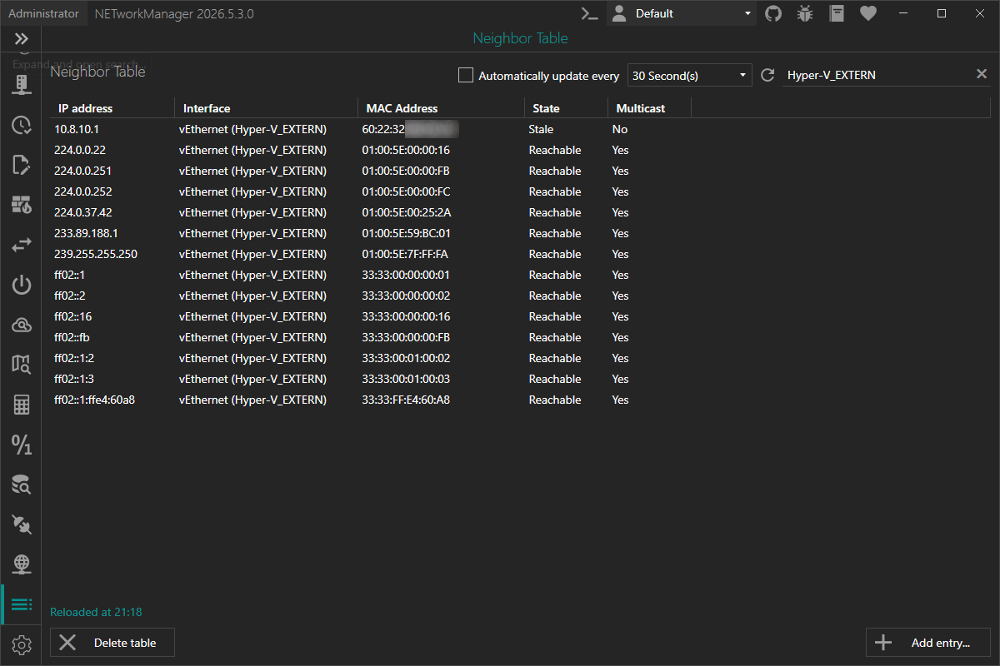
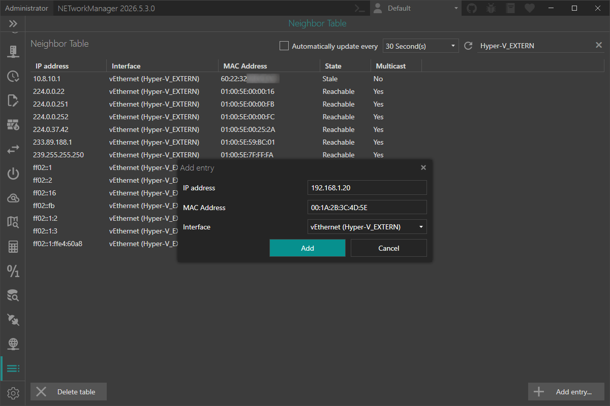

The **ARP Table** feature has been replaced by the new **Neighbor Table**, a unified view that covers IP-to-MAC address mappings for both IPv4 (ARP) and IPv6 (NDP) in a single place.

<!-- truncate -->

## Why the change?

The old ARP Table only surfaced IPv4 entries. Modern networks increasingly rely on IPv6, and the equivalent mechanism on IPv6 – the **Neighbor Discovery Protocol (NDP)** – was left out entirely.

Rather than adding a separate IPv6 view, NETworkManager now provides a single **Neighbor Table** that shows both IPv4 and IPv6 neighbors side by side, reflecting what the Windows networking stack actually maintains.

## ARP vs. NDP — what's the difference?

**IPv4 – ARP (Address Resolution Protocol)** is a layer-2 protocol that maps IPv4 addresses to MAC addresses. When a device needs to send data to an IPv4 address, it first checks the ARP cache. If no entry is found, it broadcasts an ARP request; the target replies with its MAC address and the entry is cached.

**IPv6 – NDP (Neighbor Discovery Protocol)** fulfills the same purpose for IPv6. Instead of broadcasts, NDP uses ICMPv6 Neighbor Solicitation and Advertisement messages sent to a solicited-node multicast address — making it more efficient and multicast-friendly.

Both protocols are susceptible to spoofing/poisoning attacks that can manipulate cached mappings and lead to man-in-the-middle scenarios.

## What the Neighbor Table shows

Each row in the table represents one cached neighbor entry and includes:

| Column | Description |
| --- | --- |
| **IP Address** | IPv4 or IPv6 address of the cached neighbor. |
| **Interface** | Human-readable name of the network interface (e.g. `Ethernet`, `Wi-Fi`). |
| **MAC Address** | Link-layer (MAC) address associated with the IP address. |
| **State** | Current reachability state (Reachable, Stale, Permanent, …). |
| **Multicast** | Indicates whether the IP address is a multicast address. |

You can refresh the table at any time with `F5`, and right-click any row to copy or export individual values, or to delete the selected entry.

## Adding static entries

You can also add permanent static neighbor entries — useful for pinning a critical device's MAC address so that ARP/NDP spoofing cannot redirect its traffic.

Click **Add entry...** below the table, supply an IPv4 or IPv6 address, the target MAC address, and the interface — NETworkManager takes care of the rest using `New-NetNeighbor` under the hood.

:::note

Adding and deleting neighbor entries requires administrator privileges. If NETworkManager is not running as administrator, the view is in read-only mode. Use the **Restart as administrator** button to relaunch with elevated rights.

:::

## Try it now

You can test this feature in the [latest pre-release of NETworkManager](https://borntoberoot.net/NETworkManager/download#pre-release).

More details are available in the [official documentation](https://borntoberoot.net/NETworkManager/docs/application/neighbor-table).

If you find any issues or have suggestions, please open an [issue on GitHub](https://github.com/BornToBeRoot/NETworkManager/issues).
